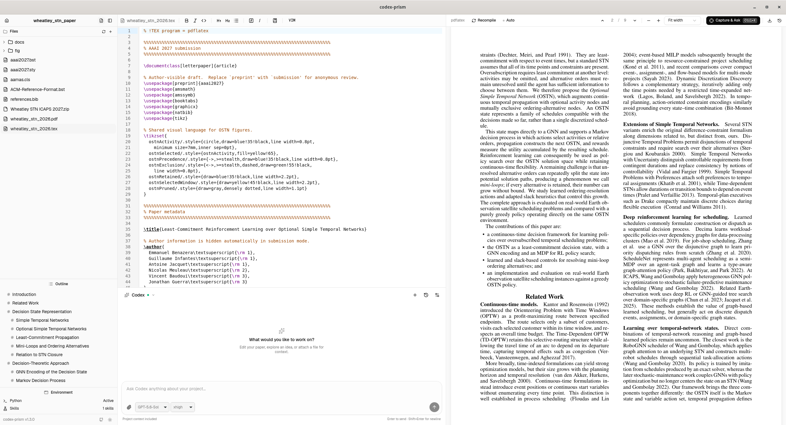

<p align="center">
  
</p>

<h1 align="center">codex-prism</h1>

<p align="center">Scientific writing with Codex, LaTeX, and PDF preview in one workspace.</p>

codex-prism is a local, single-user desktop application powered by your installed Codex CLI. Write and revise papers with an AI assistant, edit LaTeX when you need to, and review the compiled document alongside your conversation.



[Quickstart](#quickstart) · [Features](#features) · [Build from source](#build-from-source) · [Releases](https://git.jolibrain.com/beniz/codex-prism/releases)

## Quickstart

Packaged releases currently target **Ubuntu 26.04 LTS, x86_64**.

### 1. Install the application

Download the `.deb` or `.AppImage` from [the releases page](https://git.jolibrain.com/beniz/codex-prism/releases). For version 1.4.0, install the Debian package from your download directory:

```sh
sudo apt install ./codex-prism-1.4.0-linux-x86_64.deb
```

Or run the AppImage:

```sh
chmod +x codex-prism-1.4.0-linux-x86_64.AppImage
./codex-prism-1.4.0-linux-x86_64.AppImage
```

Launch the installed Debian package from your applications menu. Packaged builds do not require the application's Node.js or Rust build toolchain. Updates are installed manually; download checksums are included in each release.

### 2. Set up Codex and LaTeX

Install the Codex CLI separately and authenticate with `codex login`, or use **Connection → Sign in** in the app. The app uses the installed CLI's account and configuration. If Codex is not found on PATH, set its full executable path in **Connection** and restart the app.

Install system TeX Live to compile documents:

```sh
sudo apt install texlive-latex-extra texlive-publishers texlive-fonts-recommended texlive-xetex texlive-luatex texlive-bibtex-extra biber
```

Python environments and external scientific skills are optional and can be configured later in settings.

### 3. Open a project and start writing

Open an existing LaTeX project or create one from a template. Ask Codex to help draft or revise your document, and review edits with **Keep** or **Undo**. Sending another chat prompt implicitly keeps pending changes once the new turn starts successfully.

Use **Recompile** to build the PDF, or enable **Auto** for automatic recompilation. Existing PDFs load immediately when available. Toggle **Code** beside **Layout** to hide the LaTeX source while keeping the chat and PDF visible.

## Features

- **Codex assistant** — chat alongside the document, attach project files, select models and reasoning effort, approve tool requests, and resume conversations.
- **LaTeX editor** — CodeMirror with syntax highlighting, search, multi-file projects and auto-save. Hide the source panel while keeping the chat and PDF visible.
- **PDF preview** — MuPDF rendering with SyncTeX navigation, zoom and text selection. Existing PDFs load at startup before a new compilation is needed.
- **Local compilation** — system TeX Live runs pdfLaTeX by default; `% !TEX program = xelatex` or `lualatex` selects another engine. Auto-recompile is optional.
- **History and proposed changes** — local Git snapshots, comparisons and restoration, plus Keep/Undo review of assistant edits.
- **Python environment** — optional [uv](https://docs.astral.sh/uv/) installation and explicit project environment setup in settings. Opening a project does not create or modify its environment.
- **Scientific writing instructions** — project `AGENTS.md` guidance, including TikZ for technical drawings, and optional skills from [K-Dense Scientific Skills](https://github.com/K-Dense-AI/claude-scientific-skills).
- **Templates and project wizard** — start papers, theses, presentations and other LaTeX documents.
- **Desktop tools** — external editor integration and light/dark themes.

## LaTeX compilation

The default engine is **pdfLaTeX**. For XeLaTeX or LuaLaTeX, add one of these comments within the main document's first 20 lines:

```tex
% !TEX program = xelatex
```

```tex
% !TEX program = lualatex
```

Individual documents may require additional fonts, publisher classes or language packages. The app uses system TeX Live and does not download TeX packages automatically. Existing PDFs can be viewed without a compiler installed.

## Data and privacy

Documents and compilation stay on your machine. AI requests send prompts and the content used by Codex to its configured provider for inference. Credentials are managed by the installed Codex CLI; signing out affects that shared login.

Existing project instructions, skills, Python environments and history are preserved. The legacy `.claudeprism/history.git` directory name is retained for compatibility with existing projects. New project instructions use `AGENTS.md`, and scientific skills use `.agents/skills`.

The application is currently local and single-user. Browser hosting and project collaboration are not included yet.

## Build from source

For development or running directly from a repository checkout on Ubuntu 26.04 LTS x86_64, follow these steps. Codex and TeX Live are set up as described in the [quickstart](#quickstart).

1. Install Node.js 22+, Corepack, Git, and the Linux Tauri development libraries (Ubuntu/Debian):
   ```sh
   sudo apt install build-essential pkg-config libwebkit2gtk-4.1-dev libayatana-appindicator3-dev librsvg2-dev libssl-dev
   ```
2. Install Rust with rustup. This checkout pins Rust 1.88.0.
3. Clone the repository and start the app:
   ```sh
   git clone https://git.jolibrain.com/beniz/codex-prism.git
   cd codex-prism
   corepack pnpm install --frozen-lockfile
   corepack pnpm dev:desktop
   ```

The default launcher disables automatic native restarts and frontend hot reloads. To apply application code changes, close the app, stop the launcher with Ctrl+C if needed, and run `corepack pnpm dev:desktop` again. Editing your LaTeX documents and compiling PDFs still works normally.

For a short Linux command available from any directory, install a symlink from this checkout:

```sh
mkdir -p ~/.local/bin
ln -s "$PWD/scripts/codex-prism" ~/.local/bin/codex-prism
```

With `~/.local/bin` on your PATH, run `codex-prism`. Each launch uses the current checkout, rebuilding the native app as needed and serving the current frontend. Keep the terminal open while using the app. Use `codex-prism --watch` to enable automatic reloads. If you move the checkout, update the symlink.

To opt into automatic reloads and native rebuilds during development, use `corepack pnpm dev:desktop:watch`.

To build an installable desktop package: `corepack pnpm build:desktop`.

If you also install a packaged release, the `~/.local/bin/codex-prism` launcher may take precedence over the packaged command. It continues to run the repository checkout.

### Verification

```sh
corepack pnpm --filter @codex-prism/desktop test
corepack pnpm --filter @codex-prism/desktop build
cargo test --manifest-path apps/desktop/src-tauri/Cargo.toml --lib
node scripts/verify-codex.mjs
```

The last command checks the installed server's initialization, account status and model catalogue without sending an inference prompt or printing credentials. Add `--exercise` to run one small inference turn in a disposable temporary directory and verify file editing and session resume. Integration was checked against Codex 0.160.1; an incompatible app-server protocol reports an error rather than falling back to another provider.

For a hands-on acceptance check, open a disposable LaTeX project, ask Codex to edit a paragraph, verify streaming and model selection, then Keep one file and Undo another. Test Stop, an approval request, reopening a chat and restarting with a pending review. Check compilation/PDF navigation and externally edit a file before Save/Undo to verify conflict protection.

### Architecture and change review

- `crates/prism-core` contains the headless Rust backend: projects/files, compilation, history, agent supervision/review, Python environments and scientific skills. The desktop crate supplies thin Tauri commands, event delivery and native integration.
- The Rust backend supervises one `codex app-server --listen stdio://` process. The webview receives conversation events and approval requests; credentials remain in Codex's normal credential store.
- Projects have persistent UUIDs. File operations carry `{projectId, path}` with paths relative to the project directory. The desktop adapter resolves host paths for native pickers and assets. Rename preserves the project ID; a backend relocate operation is also available for a later project-management UI.
- The agent saves dirty buffers before starting, runs with `workspace-write` and `on-request` approvals, and allows one active turn per project. Unrelated CLI sessions are not imported into its chat list.
- File editing is locked during a turn and pending review, but pending review does not block the next chat prompt. Sending a new prompt implicitly keeps pending changes once Codex confirms the new turn has started; Undo then applies only to the new turn. A failed start preserves the prior review. At completion, the app reviews the actual project source/asset changes, including command-generated changes. Keep accepts the current disk contents; Undo restores the saved bytes only if the file still matches the completed turn. Text saves likewise refuse to overwrite an external edit.
- Review baselines and session mappings persist in the application's data directory, separately from project source. Restart recovers interrupted reviews. Prompts are never automatically resubmitted after a disconnect. Generated build files, hidden/environment directories and symlinks are excluded from snapshots; changes outside that scope cannot be undone by project review.
- LaTeX/PDF and history features remain; Python and external scientific skills are optional. Existing `.claudeprism/history.git` history is deliberately retained. New project instructions use `AGENTS.md`; scientific skills use `.agents/skills`.
- Hosts construct a shared `prism_core::Backend` with explicit application-data, home and temporary paths, an `EventSink`, and optionally a native directory-permission hook. Construction recovers interrupted reviews; `shutdown().await` rejects new work, stops the agent and background installers, drains admitted work, and retains persisted projects/builds. The headless default never opens native permission dialogs.
- `apps/desktop/src/lib/backend` is the frontend transport boundary and `desktop-host.ts` owns desktop window/dialog/open-link APIs. The implementation remains Tauri-only at this stage; a hosted transport, browser import/export, authentication and remote isolation remain future work.

### Creating releases

Linux releases target Ubuntu 26.04 LTS x86_64 and are hosted on [Gitea](https://git.jolibrain.com/beniz/codex-prism/releases). The release tooling supports local builds without a CI runner, checks version consistency, and collects packages with checksums. Uploads create a draft for review before publication.

See [the release guide](docs/releases/README.md) for version preparation, tagging, building, uploading, and optional Gitea Actions setup.

## Contributing

See [CONTRIBUTING.md](./CONTRIBUTING.md) for the inherited development guidelines. The build and verification commands above describe this fork.

## License

[MIT](./LICENSE)

## Acknowledgments

This project is a fork of [ClaudePrism](https://github.com/delibae/claude-prism) by delibae, adapted to use Codex as its AI backend. ClaudePrism started from [Open Prism](https://github.com/assistant-ui/open-prism) by [assistant-ui](https://github.com/assistant-ui).
